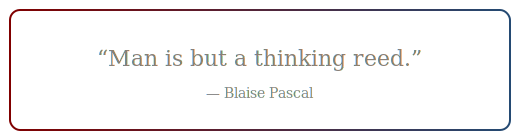

# Why this blog

I spend most of my time doing research on LLM safety, and somewhere along the
way I started rebuilding my mathematics from first principles — actual
chapters, with proofs, written slowly. This blog is where those notes live,
along with occasional thoughts that don't fit anywhere else.

Posts are organized by topic (**math**, **research**, **musings**) and by
time; pick whichever view you like on the [home page](../../).

# What posts can contain

Posts are written in Markdown or converted from LaTeX. Math renders through
MathJax, inline like $e^{i\pi} + 1 = 0$ or displayed:

$$
\gcd(a,b) = \min\,\{\, ax + by \;\mid\; x, y \in \Z,\; ax + by > 0 \,\}.
$$

Code blocks work too:

```python
def gcd(a, b):
    while b:
        a, b = b, a % b
    return a
```

And images:



That's it for now — the first real post is [Chapter 1 of the math
notes](../integers-divisibility-and-proof/).
